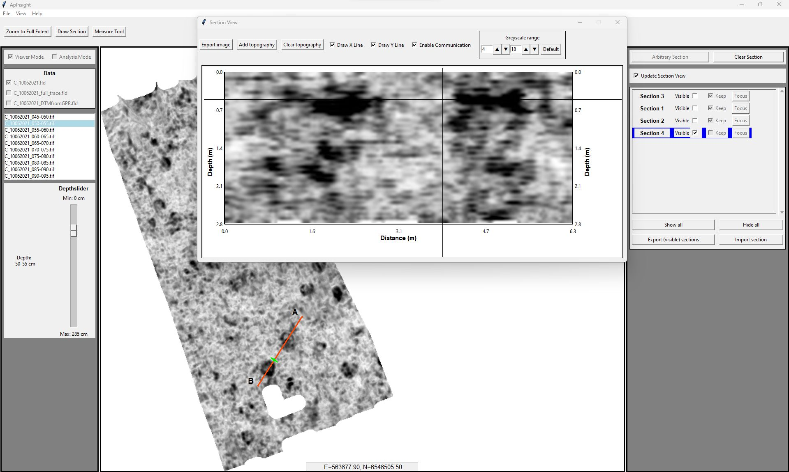

# ApInsight [](https://zenodo.org/doi/10.5281/zenodo.10639764)

### Interactive analysis and visualization of 3D ground-penetrating radar data



## Overview

ApInsight is an open-source Python application for the visualization and analysis of processed three-dimensional ground-penetrating radar (GPR) datasets. It was developed primarily for archaeological GPR data processed with ApRadar (GeoSphere Austria) and uses the ApRadar `.fld` format as its principal input format.

ApInsight complements conventional interpretation of horizontal GPR depth slices by providing interactive access to the three-dimensional data volume. Arbitrary vertical sections can be extracted along user-defined lines and viewed together with the corresponding horizontal depth-slice data. This facilitates the investigation of the vertical geometry of reflections, stratigraphic relationships, and the depth and shape of archaeological and geological structures.

The application also provides project management, measurement and drawing tools, GIS interoperability, and export of section images.

A sample dataset is available in the [ApInsight-SampleData](https://github.com/erichnau/ApInsight-SampleData) repository, allowing ApInsight to be tested without access to an existing ApRadar dataset.

ApInsight is primarily developed and tested on Windows and can also be used on Linux.

## Features

- **Graphical User Interface:** Offers an intuitive layout for easy navigation and interaction.
- **Project File Management:** Simplifies project setup, data handling, and management through various GUI components. Enables creation of project files in `.json` format containing links to necessary files and folders.
- **Data Preprocessing:** Provides functions to create depth-slice images from `.fld` files and preprocess `.fld` files for fast visualization.
- **Depth-Slice Viewer:** Allows access to all depth-slice images defined in a project file, enabling simple switching between different datasets.
- **Measurement Tool:** Facilitates measurement of distances and areas on depth-slice images.
- **Drawing Tool:** Enables drawing, storing, and viewing of section lines on depth-slice images. Section lines can be stored in the project file and exported to or imported from Shapefiles (`.shp`), allowing interoperability with GIS software.
- **Section Tool:** Extracts arbitrary vertical sections through a chosen dataset along drawn section lines. Facilitates communication between the depth-slice viewer and section view for detailed data analysis. Section images can be exported as `.png` files.
- **Topographic Correction:** Vertical sections can be corrected using corresponding digital terrain model (DTM) data where available.

## Installation

### Prerequisites

- Clone this repository or download the source code.
- Python 3.9 or newer is required.
- Continuous integration currently tests Python 3.12 and Python 3.14.
- Install the required Python packages listed in `requirements.txt`.

From the ApInsight directory run:

```bash
pip install -r requirements.txt
```

Then start ApInsight with:

```bash
python main.py
```

A short introductory video for users unfamiliar with setting up a Python environment is available here:

https://youtu.be/f0AKAc0pgbo

### Tkinter on Windows

ApInsight uses Tkinter for its graphical user interface. Tkinter is normally included with standard Python installations on Windows.

If ApInsight fails during startup with an error such as:

```text
_tkinter.TclError: Can't find a usable init.tcl
```

check the Python/Tkinter installation independently by running:

```bash
python -m tkinter
```

If this command produces the same error, Tcl/Tk is missing or incorrectly configured in the Python installation rather than the error originating from ApInsight. Repairing or reinstalling Python with Tcl/Tk support should resolve the problem.

## Sample Data

A sample archaeological GPR dataset is available from the separate [ApInsight-SampleData](https://github.com/erichnau/ApInsight-SampleData) repository.

The sample data can be used to explore the main ApInsight workflow without access to an existing ApRadar project. It includes processed `.fld` data and associated files required for testing the visualization and section-extraction functionality.

A typical workflow is:

1. Install and start ApInsight.
2. Download the ApInsight sample dataset.
3. Create or open an ApInsight project using the supplied `.fld` dataset.
4. Browse the horizontal depth slices.
5. Draw a section line across an area of interest.
6. Open the section view to extract and inspect the corresponding vertical section through the 3D GPR volume.

The sample dataset is also intended to provide a reproducible example for evaluating and testing ApInsight.

## Usage

To start the application, run:

```bash
python main.py
```

The main application window will open and provide access to the project, depth-slice, measurement, drawing, and section tools.

A detailed video introduction to the ApInsight workflow and its principal functions is available here:

https://youtu.be/lIJPaZ917v4

## Testing

Automated tests cover core numerical and data-handling functionality, including coordinate conversion, arbitrary-section extraction and interpolation, topographic correction, and project-data handling.

The tests can be run from the repository root with:

```bash
python -m pytest
```

The test suite is automatically executed through GitHub Actions on pushes and pull requests and is currently tested against Python 3.12 and Python 3.14.

## Contributing

Contributions, bug reports, and feature requests are welcome.

Please use the GitHub issue tracker to report problems or suggest improvements. Code contributions can be submitted through pull requests.

See [CONTRIBUTING.md](CONTRIBUTING.md) for contribution guidelines, testing requirements, and information about project maintenance and support.

## License

ApInsight is released under the MIT License. See the [LICENSE](LICENSE) file for details.

## Citing ApInsight

If you use ApInsight in research or other published work, please cite the software using its permanent Zenodo DOI:

**Nau, E. (2024). ApInsight: Ground Penetrating Radar Data Analysis Tool. Zenodo.**  
https://doi.org/10.5281/zenodo.10639764

This DOI represents all versions of ApInsight and resolves to the latest archived release. Individual software releases are also assigned version-specific DOIs by Zenodo.

A software paper describing ApInsight is in preparation for the Journal of Open Source Software (JOSS).

## Acknowledgements

Development of ApInsight was supported by strategic research funding from the Norwegian Institute for Cultural Heritage Research (NIKU). These funds form part of NIKU's institutional basic funding from the Norwegian government, administered by the Research Council of Norway.

Financial support from [GeoSphere Austria](https://www.geosphere.at/) contributed to the further development and enhancement of the software.

Special thanks are extended to Alois Hinterleitner from GeoSphere Austria, the original developer of ApRadar. His assistance in understanding and handling the custom `.fld` file format was greatly appreciated.

Special thanks are also extended to [Markus Angermann](https://www.angermann.at/) for programming instruction, code review, and advice during the restructuring and documentation of the ApInsight codebase.